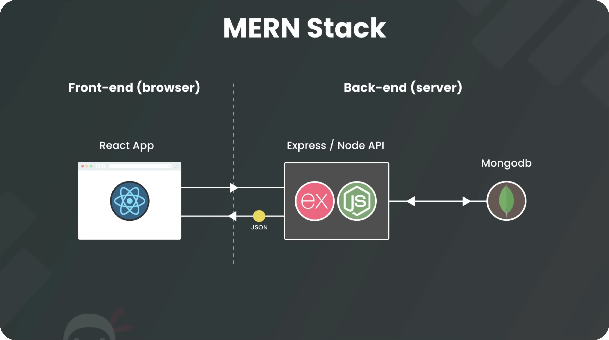
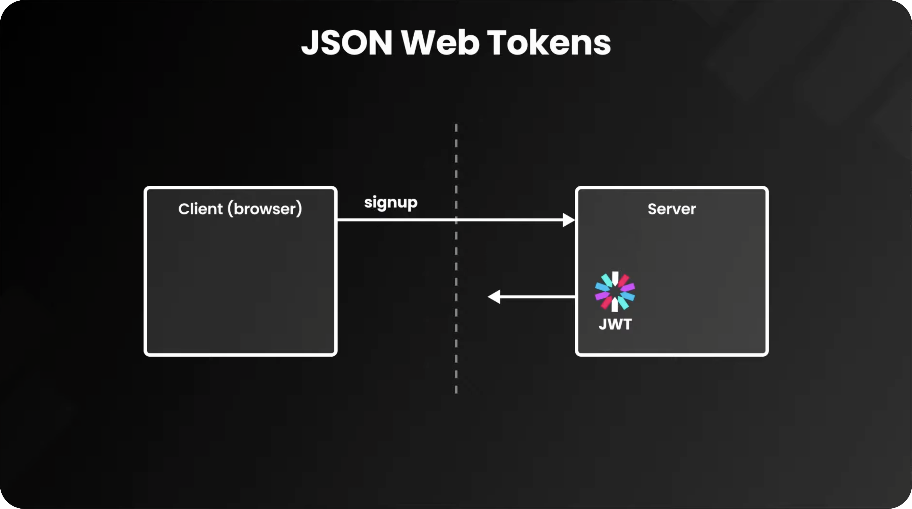

# MERN Stack Crash Course

## 📖 MERN Stack Chapters

1. What is the MERN Stack?
1. Express App Setup
1. Express Router & API Routes
1. MongoDB Atlas & Mongoose
1. Models & Schemas
1. Controllers (part 1)
1. Controllers (part 2)
1. Making a React App
1. Fetching Data
1. New Workout Form
1. Adding React Context
1. Deleting Data
1. Handling Error Responses
1. Finishing Touches

## 📖 Auth with JWT Chapters

1. Intro & Starter Project
1. User Routes, Controller & Model
1. Signing Up & Hashing Passwords
1. Email & Password Validation
1. JSON Web Tokens (theory)
1. Signing Tokens
1. Logging Users In
1. React Auth Context
1. Login & Signup Forms
1. Making a useSignup Hook
1. Making a useLogout Hook
1. Making a useLogin Hook
1. Setting the Initial Auth Status
1. Protecting API Routes
1. Making Authorized Requests
1. Protecting React Routes
1. Assigning Workouts to Users
